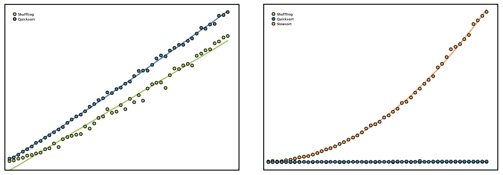

## Izziv časovna kompleksnost

V programskem jeziku Java je podana funkcija `double[] values(int size)`, ki **ustvari tabelo** naključno izbranih realnih števil velikosti `size`.

```java
public static double[] values(int size) {
	double[] values = new double[size];
	for (int i = 0; i < size; i++)
		values[i] = Math.random();
		
	return values;
}
```

Nadalje je podana metoda `void quicksort(double[] values)` za **hitro urejanje tabele** realnih števil `values`. Časovna kompleksnost podane metode je enaka $\mathcal{O}(n\log n)$, kjer je $n$ število števil v tabeli. Moč je pokazati, da je to optimalna časovna kompleksnost poljubnega algoritma urejanja.

```java
public static void quicksort(double[] values) {
	quicksort(values, 0, values.length - 1);
}
	
public static void quicksort(double[] values, int low, int high) {
	if (low < high) {
		int pivot = partition(values, low, high);
	
		quicksort(values, low, pivot - 1);
		quicksort(values, pivot + 1, high);
	}
}
```

```java
private static int partition(double[] values, int low, int high) {
	double pivot = values[high];
		
	int i = low;
	for (int j = low; j < high; j++)
		if (values[j] < pivot) {
			swap(values, i, j);
			i++;
		}
		
	swap(values, i, high);
		
	return i;
}

private static void swap(double[] values, int i, int j) {
	double value = values[i];
	values[i] = values[j];
	values[j] = value;
}
```

Najprej sestavite metodo `void shuffle(double[] values)`, ki **naključno premeša tabelo** realnih števil `values`. Metoda naj najprej izbere naključno število v tabeli `values` in ga prestavi na prvo mesto z uporabo `void swap(double[] values, int i, int j)`. Metoda naj nato izbere naključno število iz preostanka tabele in ga prestavi na drugo mesto. Omenjen postopek ponavljajte dokler celotna tabela ni premešana. Časovna kompleksnost opisane metode je enaka $\mathcal{O}(n)$, kjer je $n$ število števil v tabeli.

Nato sestavite metodo `void slowsort(double[] values)` za **urejanje tabele** realnih števil `values` **z izbiranjem**. Metoda naj najprej poišče najmanjše število v tabeli `values` in ga prestavi na prvo mesto. Metoda naj nato poišče najmanjše število v preostanku tabele in ga prestavi na drugo mesto. Omenjen postopek ponavljajte dokler celotna tabela ni urejena. Časovna kompleksnost opisane metode je enaka $\mathcal{O}(n^2)$, kjer je $n$ število števil v tabeli.

Na koncu sestavite še program, ki **izriše čase izvajanja** metod `shuffle`, `quicksort` in `slowsort` za smiselno izbrane velikosti tabele `values`. Čase izvajanja metod izmerite z dvema zaporednima klicema funkcije `System.currentTimeMillis()`, ki vrne trenutno število milisekund od epohe 1. januarja 1970, dočim čase izvajanja metod izrišite s točkami različnih barv. Poleg časov izvajanja metod izrišite tudi **oceno časovne kompleksnosti** metod s polno črto, katere ocenite s pomočjo metode najmanjših kvadratov. Vse potrebne metode in funkcije naj bodo definirane v razredu `Complexity`.

Primer izrisa časov izvajanja metod je podan spodaj. 


