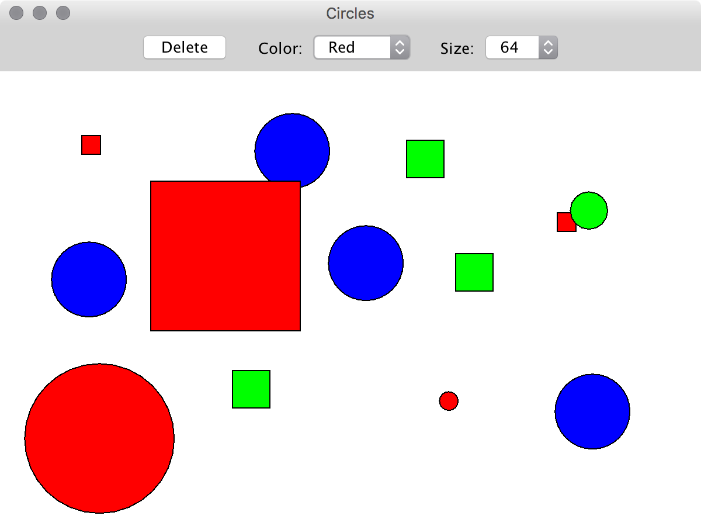

###### Programiranje 2 2019/20 (j2)

## Grafični vmesniki v programskem jeziku Java

V programskem jeziku Java je podan program `Circles.java` z dvema razredoma. Javni **razred** `Circles` **predstavlja enostaven grafični vmesnik** z dvema paneloma. Zgornji panel `console` vsebuje različne grafične komponente (tj. labele, gumbe, izbirnike ipd.), dočim osrednji panel `panel` predstavlja površino za risanje. Pomožni **razred** `Circle` **predstavlja krog** definiran z relativnimi koordinatami središča kroga `x` in `y`, polmerom kroga `radius` in barvo kroga `color`. Poleg zgornjega razred `Circles` vsebuje še seznam krogov za risanje `circles`.

```java
import java.awt.BorderLayout;
import java.awt.Color;
import java.awt.Dimension;
import java.awt.Graphics;
import java.awt.event.ActionEvent;
import java.awt.event.ActionListener;
import java.awt.event.MouseEvent;
import java.awt.event.MouseListener;
import java.util.ArrayList;
import java.util.List;

import javax.swing.JButton;
import javax.swing.JComboBox;
import javax.swing.JFrame;
import javax.swing.JLabel;
import javax.swing.JPanel;

public class Circles extends JFrame {
	
	private static final long serialVersionUID = 1L;
	
	private List<Circle> circles;
	
	public Circles() {
		super();
		
		circles = new ArrayList<Circle>();
		
		setTitle("Circles");
		setDefaultCloseOperation(JFrame.EXIT_ON_CLOSE);
		getRootPane().putClientProperty("apple.awt.brushMetalLook", true);
		setPreferredSize(new Dimension(800, 600));
		setMinimumSize(new Dimension(600, 450));
		setLayout(new BorderLayout());
		
		JPanel console = new JPanel();
		add(console, BorderLayout.NORTH);
		
		console.add(new JLabel("    Color:"));
		
		JComboBox<String> colors = new JComboBox<String>(new String[] { "Red", "Green", "Blue" });
		console.add(colors);
		
		console.add(new JLabel("    Size:"));
		
		JComboBox<Integer> sizes = new JComboBox<Integer>(new Integer[] { 8, 16, 32, 64 });
		console.add(sizes);
		
		JPanel panel = new JPanel();
		panel.setBackground(Color.WHITE);
		add(panel, BorderLayout.CENTER);
	}

	public static void main(String[] args) {
		new Circles().setVisible(true);
	}

}

class Circle {
	
	private double x;
	
	private double y;
	
	private int radius;
	
	private Color color;

	public Circle(double x, double y, int radius, Color color) {
		super();
		this.x = x;
		this.y = y;
		this.radius = radius;
		this.color = color;
	}

	public double getX() {
		return x;
	}

	public double getY() {
		return y;
	}

	public int getRadius() {
		return radius;
	}

	public Color getColor() {
		return color;
	}
	
}
```

Vaša naloga je, da v programskem jeziku Java sestavite program za **risanje krogov**, ki jih **uporabnik dodaja s klikanjem** po grafičnem vmesniku.

###### _1. korak_

Najprej panelu `panel` **dodajte poslušalca**, **ki ob miškinem kliku** na panel v seznam krogov `circles` v razredu `Circles` **doda krog** `Circle` z naslednjimi lastnostmi. Središče kroga naj bo na lokaciji klika, ki je določena relativno. To pomeni, da se ob kliku na središče panela doda krog s središčem v `x = 0.5` in `y = 0.5`, ki se vedno izriše v središču panela ne glede na njegovo velikost. Barva kroga naj bo enaka barvi, ki je trenutno izbrana v izbirniku `colors`, polmer kroga pa naj bo enak vrednosti, ki je trenutno izbrana v izbirniku `sizes`. Poskrbite, da se ob miškinem kliku nov krog nemudoma izriše na panelu (glejte spodaj)!

###### _2. korak_

Nato panelu `panel` **posodobite metodo** `paint(Graphics g)`, **ki naj izriše seznam krogov** `circles` v razredu `Circles`. Vsak krog naj se izriše v svojem središču `x` in `y` s polmerom `radius`, dočim naj bo zapolnjen s svojo barvo `color`. Poleg tega naj ima vsak krog tudi črno obrobo.

###### _3. korak_

Nato na levi strani panela `console` **dodajte gumb** z napisom `Delete`, **ki ob kliku izbriše seznam krogov** `circles` v razredu `Circles`. Poskrbite, da se ob kliku vsi krogi nemudoma izbrišejo iz panela (glejte zgoraj)!

###### _4. korak_

Na koncu programu **dodajte še možnost za izris kvadratov**. V ta namen definiraje razred `Square`, ki naj deduje razred `Circle` in v čim večji meri uporablja njegove funkcije in metode. Ob miškinem kliku naj se sedaj naključno določi ali je dodan lik krog `Circle` ali kvadrat `Square`, dočim naj bodo vse ostale funkcionalnosti enake kot zgoraj.

Pričakovan izgled grafičnega vmesnika po nekaj miškinih klikih je podan spodaj.


