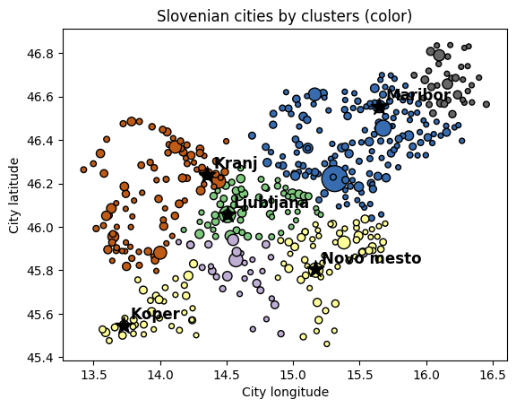

###### Programiranje 2 2018/19 (p5)

## Napredna analiza in prikaz podatkov

### 1. Zemljevid in razvrščanje slovenskih mest

Podana je tekstovna datoteka `cities.tab` s __seznamom__ imen __slovenskih mest__, njihovimi poštnimi številkami, geografsko širino in dolžino ter številom zadetkov v iskalniku Google.

Vsebina datoteke `cities.tab` je podana spodaj, kjer so posamezne vrednosti ločene s tabulatorji.

```
city	zip	longitude	latitude	views
Ljubljana	1000	14.506	46.057	56300
Ljubljana – P.P.	1001	14.506	46.057	3780
Ljubljana – Šentvid	1210	14.453	46.104	416
Ljubljana – Šmartno	1211	14.479	46.13	433
Medvode	1215	14.403	46.142	749
Smlednik	1216	14.434	46.166	7
Vodice	1217	14.494	46.19	937
Komenda	1218	14.539	46.205	178
Laze v Tuhinju	1219	14.76	46.219	88
Motnik	1221	14.885	46.215	1
Trojane	1222	14.884	46.188	192
... 	... 	... 	... 	...
```

V programskem jeziku Python sestavite program, ki najprej prebere vsebino datoteke `cities.tab` in nato zgradi __enostaven zemljevid mest__. Vsako mesto naj bo predstavljeno s simbolom, ki označuje njegovo geografsko lokacijo, dočim naj bo velikost simbola premo sorazmerna številu zadetkov v iskalniku Google, barva simbola pa naj predstavlja poštno številko mesta. V ta namen lahko prilagodite metodo `plot_events(...)` predstavljeno na predavanjih (glejte skripto `Cv.py`).

Na zemljevidu posebej označite tudi __izbrana slovenska mesta__ podana spodaj.

```py
>>> annotations = {'Ljubljana': (46.056946, 14.505751), 'Maribor': (46.55472, 15.64667), 'Kranj': (46.23887, 14.35561), 'Koper': (45.54694, 13.72944), 'Novo mesto': (45.80397, 15.16886)}
```

Končni zemljevid __shranite v bitno sliko__ `cities.png` kot prikazuje primer na spodnji sliki. Pri delu si v čim večji meri pomagajte s programom predstavljenim na predavanjih (glejte skripto `Cv.py`).


Nato nadgradite program tako, da najprej __numerične vrednosti__ atributov mest __ustrezno normalizirate__. Naj bo $x_i$ vrednost poljubnega atributa $i$-tega mesta ter $\langle x\rangle$ in $\sigma_x$ povprečje in standardni odklon atributa preko vseh mest. Normalizirana vrednost atributa $i$-tega mesta je tedaj definirana kot
$$\widetilde{x}_{i}=\frac{x_i-\langle x\rangle}{\sigma_x}.$$

Z uporabo funkcije __metode voditeljev__ `k_means(data, k)` (glejte skripto `Cv.py`) __mesta razvrstite_- v `k` skupin, kjer je `k` neko smiselno število skupin mest. Pri tem je pomembno, da metodi voditeljev podate normalizirane vrednosti atributov mest.

Rezultat razvrščanja __shranite__ kot zemljevid __v bitno sliko__ `cities_k<k>.png` kot prikazuje primer na spodnji sliki. Ponovno si pri delu v čim večji meri pomagajte s programom predstavljenim na predavanjih (glejte skripto `Cv.py`).



### 2. Delo na Python projektu

V programskem jeziku Python sestavite program, ki nadaljuje vaše delo na izbranem __projektu podatkovne analitike__. Na primer, __sestavite razrede__, ki jih boste potrebovali tekom dela na projektu, sestavite program za __pridobivanje podatkov__ iz npr. spletnih virov ali prenesenih datotek, sestavite program za potrebno __analizo podatkov__ ali program za končno tekstovno oziroma grafično __predstavitev rezultatov__.

__ROK ZA ODDAJO__ PROJEKTA JE __ČEZ DVA TEDNA__! ČE VAŠ PROJEKT NE POTEKA PO PLANU, JE SEDAJ ZADNJI TRENUTEK, DA __PROSITE ZA POMOČ__ IZVAJALCE PREDMETA.
