###### Programiranje 2 2019/20 (Jii)

## Grafični vmesniki v programskem jeziku Java

Splošnonamenski objektno orientiran programski jezik **Java** je bil razvit kot **varen jezik za poljubno napravo**. Sintaksa zahteva daljše programe kot v programskem jeziku Python, ki pa so navadno hitrejši. Jezik se prevaja kar pomeni, da program `Demo.java` v ukazni vrstici najprej prevedete kot `javac Demo.java`, kar ustvari datoteko `Demo.class`, katero nato izvedete kot `java Demo`.

_Programming is not science, it is a skill! If you want to run as fast as Usain Bolt, you have to do a lot of running. There is no other way! And it is the same with programming. Just run a lot ;)_

V programskem jeziku **Java grafični uporabniški vmesnik** sestavimo z uporabo ogrodja AWT, ki v paketu `java.awt` definira potrebne razrede za standardne grafične elemente. Razširitev slednjih predstavljajo razredi ogrodja Swing v paketu `javax.swing`, ki prevzamejo tudi izgled operacijskega sistema.

```java
public class Visuals {
	public static void main(String[] args) {
		...
	}
}
```

### Programska okna, paneli in postavitve

Programsko okno predstavlja **ogrodje grafičnega vmesnika** programa, ki prevzame izgled oken operacijskega sistema. V programskem jeziku **Java okno** ustvarimo kot objekt razreda `JFrame` v paketu `javax.swing`, ki mu lahko določimo naslov, izgled, velikost, obnašanje itd. Okno prikažemo z uporabo metode `setVisible(boolean visible)`, dočim lahko zahtevamo ponoven izris celotnega okna kakor hitro se da z uporabo metode `repaint()`. V praksi sicer navadno definiramo nov podrazred razreda `JFrame`, dočim tedaj prvi del spodnjega programa vključimo v konstruktor (pod)razreda.

```java
JFrame frame = new JFrame("Visuals");
frame.setSize(new Dimension(1024, 768));
frame.setMinimumSize(new Dimension(800, 600));
frame.setResizable(true);
...
// frame.getRootPane().putClientProperty("apple.awt.brushMetalLook", true);
frame.setDefaultCloseOperation(JFrame.EXIT_ON_CLOSE);
frame.setVisible(true);
```
```java
while (true) {
	...
	frame.repaint();
	try {
		Thread.sleep(50);
	} catch (InterruptedException e) {
		e.printStackTrace();
	}
}
```

Primer izgleda grafičnega vmesnika je prikazan spodaj.

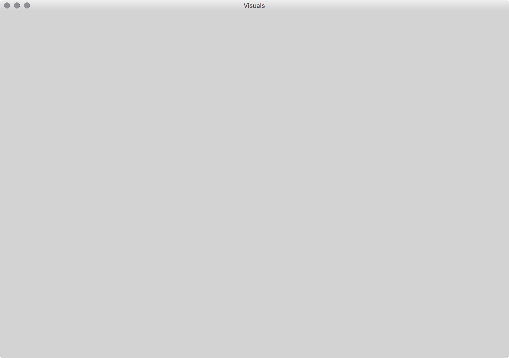

V programskem jeziku **Java** lahko z uporabo metode `add(JPanel panel)` oknu dodamo panele, ki so objekti razreda `JPanel` v paketu `javax.swing`. Po **panelih** lahko **rišemo**, jim **dodajamo grafične elemente** (npr. gumbi, vnosna polja, drsniki, izbirniki) itd. Panel zopet prevzame izgled operacijskega sistema, dočim pa mu lahko sami določimo izgled, velikost, ozadje, obnašanje itd. V praksi sicer navadno definiramo nov podrazred razreda `JPanel`.

```java
JPanel panel = new JPanel();
panel.setBackground(Color.WHITE);
frame.add(panel);
```

Primer izgleda grafičnega vmesnika je prikazan spodaj.


Kot v primeru zgoraj, lahko **vsem grafičnim elementom**, ki so objekti razreda `Containter` v paketu `java.awt` ali njegovih podrazredov (npr. `frame`), z uporabo metode `add(Component component)` **dodamo** druge **grafične elemente**, ki so objekti razreda `Component ` ali njegovih podrazredov (npr. `panel`). Pred tem lahko z uporabo metode `setLayout(LayoutManager layout)` **določimo postavitev elementov** kot objekt razreda, ki implementira vmesnik `LayoutManager`.

Programska okna `JFrame` privzeto uporabljajo postavitev `BorderLayout`, ki okno razdeli na osrednji del (tj. `BorderLayout.CENTER`) in štiri stranske dele (npr. `BorderLayout.WEST`). Pri tem je velikost slednjih najmanjša možna (tj. takšna kot zahtevajo grafični elementi), dočim se celoten preostali prostor okna dodeli osrednjemu delu grafičnega elementa.

```java
frame.setLayout(new BorderLayout());
frame.add(panel, BorderLayout.CENTER);
JPanel north = new JPanel();
frame.add(north, BorderLayout.NORTH);
JPanel south = new JPanel();
frame.add(south, BorderLayout.SOUTH);
```

Primer izgleda grafičnega vmesnika je prikazan spodaj.

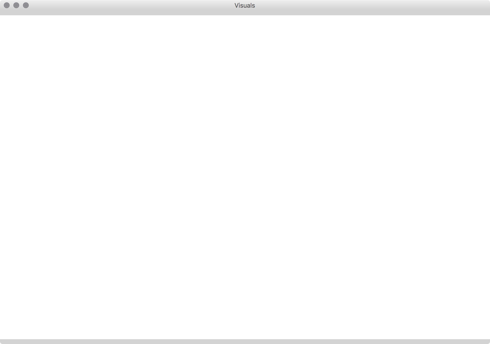

Postavitev `GridLayout` grafični element razdeli na regularno mrežo z izbranim številom vrstic in stolpcev. Pri tem je ves prostor enakomerno razdeljen med celicami mreže.

```java
south.setLayout(new GridLayout(3, 1));
for (int i = 0; i < 3; i++) {
	float rgb = (i + 1) / 4.0f;
	Color color = new Color(rgb, rgb, rgb);
	JPanel subsouth = new JPanel();
	subsouth.setBackground(color);
	south.add(subsouth);
}
```

Primer izgleda grafičnega vmesnika je prikazan spodaj.

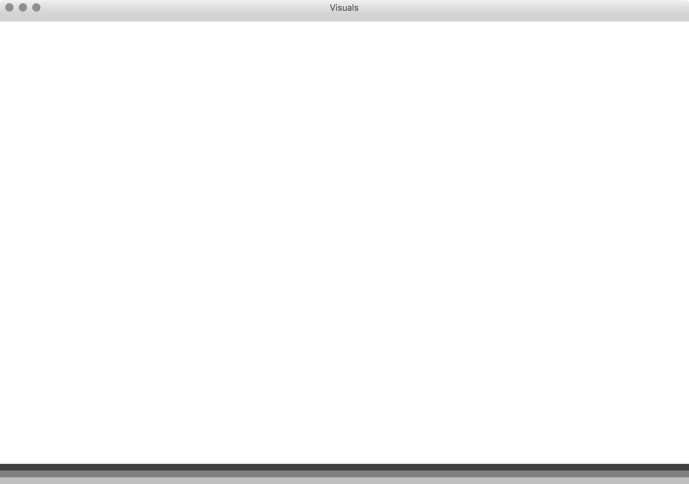

Postavitev `GridBagLayout` poleg tega omogoča, da se grafični elementi raztezajo preko več celic mreže, dočim lahko poljubno določimo razporeditev prostora po celicah.

### Risanje likov in grafičnih oblik

Po panelih razreda `JPanel` lahko **rišemo tako, da redefiniramo metodo** `paint(Graphics g)`, ki se izvede vsakič, ko je potrebno panel ponovno izrisati (npr. sprememba velikosti panela, klic metode `repaint()`). Pri tem je parameter metode objekt razreda `Graphics` oziroma `Graphics2D` v paketu `java.awt`, nad katerim lahko v nadaljevanju uporabimo različne **metode za risanje** geometrijskih **likov in** grafičnih **oblik**.

Primer razreda `Panel`, ki naj predstavlja osrednji panel programskega okna, je prikazan spodaj.

```java
class Panel extends JPanel {
	public Panel() {
		super();
		setBackground(Color.WHITE);
	}
```
```java
	@Override
	public void paint(Graphics g) {
		super.paint(g); // klic metode nadrazreda
		Graphics2D graphics = (Graphics2D)g; // pretvarjanje tipov
		int indent = 32, size = 96; // pomožne spremenljivke
		...
	}		
}
```

**Ravno črto narišemo** z uporabo metode `drawLine(int x1, int y1, int x2, int y2)`, pri čimer parametri predstavljajo koordinate začetka in konca črte. Pazite, da je **koordinatno izhodišče** postavljeno v **zgornje levo oglišče** panela! To pomeni, da koordinate `(32, 64)` predstavljajo točko 32 pikslov od levega roba panela in 64 pikslov od zgornjega roba panela. Pred samim risanjem lahko z uporabo metode `setColor(Color color)` določimo barvo čopiča in z uporabo metode `setStroke(Stroke stroke)` obliko čopiča (npr. debelino črte).

```java
int x = indent, y = indent;
graphics.setColor(Color.BLACK);
graphics.setStroke(new BasicStroke(2.0f));
graphics.drawLine(x, y, x + size, y);
```

**Kvadrat ali pravokotnik narišemo** z uporabo metode `drawRect(int x, int y, int width, int height)`, pri čimer parametri predstavljajo koordinati zgornjega levega oglišča pravokotnika ter njegovo širino in višino. Za večino `draw` metod v razredu `Graphics` obstaja tudi pripadajoča `fill` metoda, ki **zapolni površino** geometrijskega lika, in v nekaterih primerih tudi pripadajoča `drawRound` metoda, ki nariše geometrijski lik z **zaobljenimi oglišči**.

```java
y += indent;
graphics.setColor(Color.GRAY);
graphics.setStroke(new BasicStroke(1.0f));
graphics.fillRect(x, y, size, size);
graphics.setColor(Color.BLACK);
graphics.setStroke(new BasicStroke(2.0f));
graphics.drawRect(x, y, size, size);
x += indent + size;
graphics.setColor(Color.GRAY);
graphics.setStroke(new BasicStroke(4.0f));
graphics.drawRoundRect(x, y, size, size, size / 5, size / 5);
```

Primer izgleda grafičnega vmesnika je prikazan spodaj.

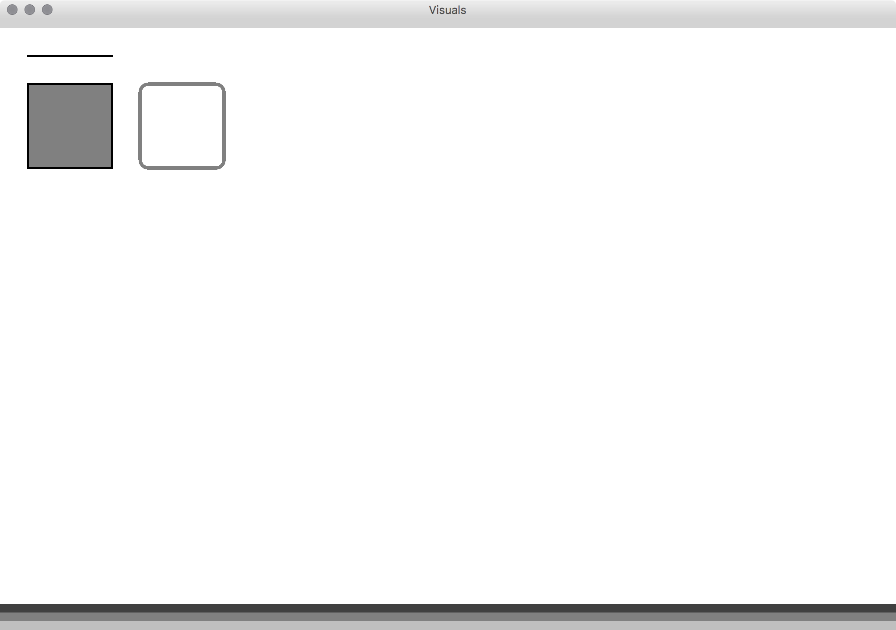

**Krog ali elipso narišemo** z uporabo metode `drawOval(int x, int y, int width, int height)`, pri čimer parametri predstavljajo koordinati zgornjega levega oglišča najmanjšega očrtanega pravokotnika ter širino in višino elipse.

```java
x = indent; y += indent + size;
graphics.setColor(Color.BLACK);
graphics.setStroke(new BasicStroke(2.0f));
graphics.drawOval(x, y, 2 * size + indent, size);
y += indent + size;
graphics.setColor(Color.GRAY);
graphics.setStroke(new BasicStroke(1.0f));
graphics.fillOval(x, y, size, size);
graphics.setColor(Color.BLACK);
graphics.setStroke(new BasicStroke(2.0f));
graphics.drawOval(x, y, size, size);
```

**Krožni izsek narišemo** z uporabo metode `drawArc(int x, int y, int width, int height, int start, int arc)`, pri čimer zadnja dva parametra predstavljata začetek in velikost krožnega izseka v stopinjah.

```java
x += indent + size;
graphics.setColor(Color.GRAY);
graphics.setStroke(new BasicStroke(4.0f));
graphics.drawArc(x, y, size, size, 90, 270);
x += indent + size;
graphics.setColor(Color.GRAY);
graphics.setStroke(new BasicStroke(1.0f));
graphics.fillArc(x, y, size, size, 20, 320);
graphics.setColor(Color.WHITE);
graphics.setStroke(new BasicStroke(2.0f));
graphics.fillOval(x + size / 2, y + size / 5, size / 8, size / 8);
```

Primer izgleda grafičnega vmesnika je prikazan spodaj.

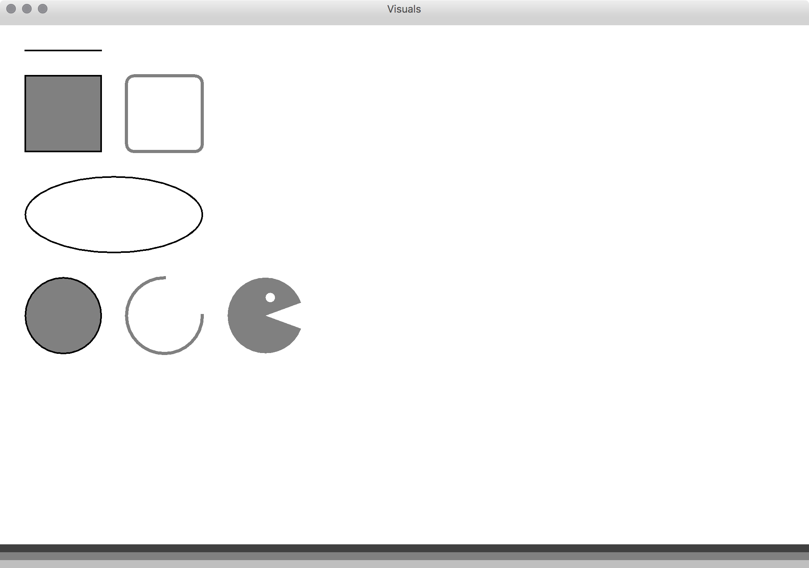

**Zaprt poligon narišemo** z uporabo metode `drawPolygon(Polygon polygon)`, pri čimer je edini parameter objekt razreda `Polygon` v paketu `java.awt`. Le-tega sestavimo kot urejeno zaporedje oglišč, ki jih dodamo poligonu z uporabo metode `addPoint(int x, int y)`.

```java
x = indent; y += indent + size;
graphics.setColor(Color.BLACK);
graphics.setStroke(new BasicStroke(2.0f));
Polygon quadrilateral = new Polygon();
quadrilateral.addPoint(x, y); quadrilateral.addPoint(x + 2 * size + indent, y + size / 2);
quadrilateral.addPoint(x, y + size); quadrilateral.addPoint(x + size + indent, y);
graphics.drawPolygon(quadrilateral);		
x += 2 * (indent + size);
graphics.setColor(Color.GRAY);
graphics.setStroke(new BasicStroke(4.0f));
Polygon polygon = new Polygon();
for (int i = 0; i < 12; i++)
	polygon.addPoint((int)(x + Math.random() * size), (int)(y + Math.random() * size));
graphics.fillPolygon(polygon);
```

Primer izgleda grafičnega vmesnika je prikazan spodaj.

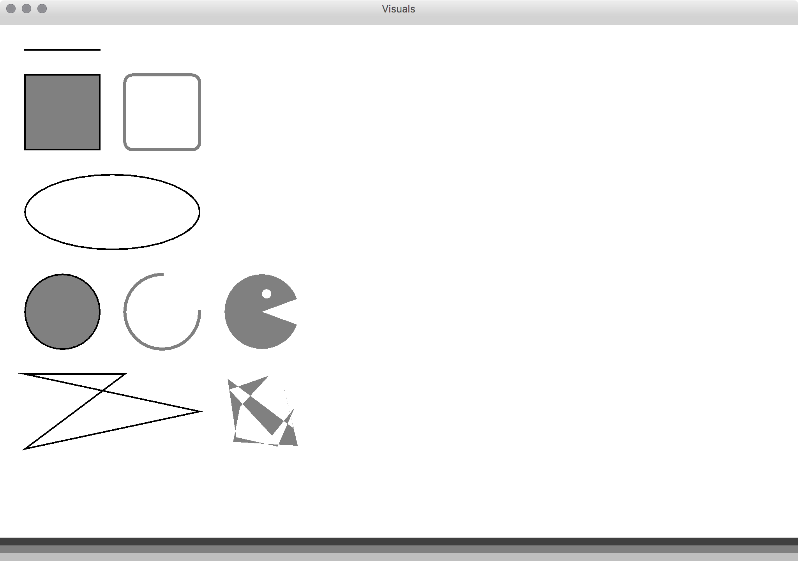

**Poljubno sliko narišemo** z uporabo metode `drawImage(Image image, int x, int y, int width, int height, ...)`, pri čimer parametri zaporedoma predstavljajo samo sliko, ki je objekt razreda `Image` v paketu `java.awt`, koordinati zgornjega levega oglišča slike ter širino in višino. Sliko lahko preberemo iz datoteke z uporabo statične metode `read(File file)` v razredu `javax.imageio.ImageIO`.

```java
y = 2 * indent;
try { // shrani sliko v objektno spremenljivko!
	graphics.drawImage(ImageIO.read(new File("images", "cats.jpg")), x, y, size, size, null);
} catch (IOException e) {
	e.printStackTrace();
}
```

Primer izgleda grafičnega vmesnika je prikazan spodaj.

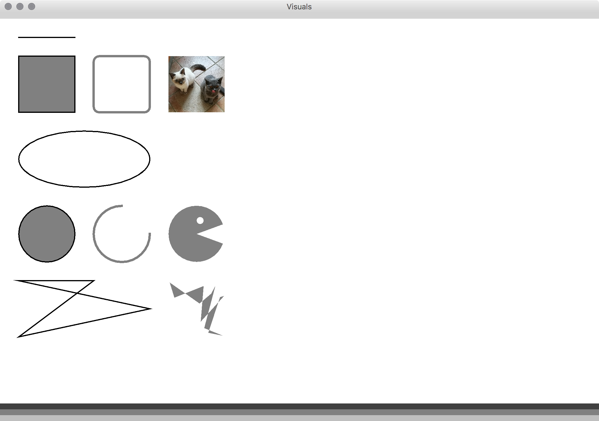

**Niz znakov narišemo** z uporabo metode `drawString(String string, int x, int y)`, pri čimer parametri predstavljajo sam niz znakov in koordinati **spodnjega levega oglišča** očrtanega pravokotnika. Pred samim risanjem lahko z uporabo metode `setFont(Font font)` določimo obliko pisave, dočim geometrijske lastnosti trenutno izbrane pisave dobimo z uporabo funkcije `getFontMetrics()`, ki vrne objekt razreda `java.awt.FontMetrics`.

Podobno lahko z uporabo funkcij `getWidth()` in `getHeight()` dobimo **trenutno širino in višino** poljubnega grafičnega elementa.

```java
x = 2 * indent + size; y = indent;
String string = getWidth() + "x" + getHeight();
graphics.setColor(Color.BLACK);
graphics.setFont(new Font("Montserrat", Font.BOLD, 11));
graphics.drawString(string, x, y);
x += size / 2; y += indent + size / 2;
graphics.setColor(Color.GRAY);
graphics.setFont(new Font(Font.SANS_SERIF, Font.BOLD, 14));
FontMetrics metrics = graphics.getFontMetrics();
graphics.drawString(string, x - metrics.stringWidth(string) / 2, y + metrics.getAscent() / 2);
```

Primer izgleda grafičnega vmesnika je prikazan spodaj.


V zgornjih primerih **risanje** različnih geometrijskih likov in grafičnih oblik ni **prilagojeno trenutni velikosti grafičnega vmesnika** oziroma osrednjega panela programskega okna. Slednje lahko dosežemo tako, da pri izrisu upoštevamo širino in višino panela po katerem rišemo.

Spodnji program vse zgornje geometrijske like in grafične oblike izriše čez celotni desni del osrednjega panela.

```java
int width = (getWidth() / 2 - 4 * indent) / 3;
int height = (getHeight() - 6 * indent) / 4;

x = getWidth() / 2 + indent; y = indent;
graphics.setColor(Color.BLACK);
graphics.setStroke(new BasicStroke(2.0f));
graphics.drawLine(x, y, x + width, y);

y += indent;
graphics.setColor(Color.GRAY);
graphics.setStroke(new BasicStroke(1.0f));
graphics.fillRect(x, y, width, height);
graphics.setColor(Color.BLACK);
graphics.setStroke(new BasicStroke(2.0f));
graphics.drawRect(x, y, width, height);
x += indent + width;
graphics.setColor(Color.GRAY);
graphics.setStroke(new BasicStroke(4.0f));
graphics.drawRoundRect(x, y, width, height, width / 5, height / 5);

x = getWidth() / 2 + indent; y += indent + height;
graphics.setColor(Color.BLACK);
graphics.setStroke(new BasicStroke(2.0f));
graphics.drawOval(x, y, 2 * width + indent, height);
y += indent + height;
graphics.setColor(Color.GRAY);
graphics.setStroke(new BasicStroke(1.0f));
graphics.fillOval(x, y, width, height);
graphics.setColor(Color.BLACK);
graphics.setStroke(new BasicStroke(2.0f));
graphics.drawOval(x, y, width, height);

x += indent + width;
graphics.setColor(Color.GRAY);
graphics.setStroke(new BasicStroke(4.0f));
graphics.drawArc(x, y, width, height, 90, 270);
x += indent + width;
graphics.setColor(Color.GRAY);
graphics.setStroke(new BasicStroke(1.0f));
graphics.fillArc(x, y, width, height, 20, 320);
graphics.setColor(Color.WHITE);
graphics.setStroke(new BasicStroke(2.0f));
graphics.fillOval(x + width / 2, y + height / 5, width / 8, height / 8);

x = getWidth() / 2 + indent; y += indent + height;
graphics.setColor(Color.BLACK);
graphics.setStroke(new BasicStroke(2.0f));
quadrilateral = new Polygon();
quadrilateral.addPoint(x, y); quadrilateral.addPoint(x + 2 * width + indent, y + height / 2);
quadrilateral.addPoint(x, y + height); quadrilateral.addPoint(x + width + indent, y);
graphics.drawPolygon(quadrilateral);
x += 2 * (indent + width);
graphics.setColor(Color.GRAY);
graphics.setStroke(new BasicStroke(4.0f));
polygon = new Polygon();
for (int i = 0; i < 12; i++)
	polygon.addPoint((int)(x + Math.random() * width), (int)(y + Math.random() * height));
graphics.fillPolygon(polygon);

y = 2 * indent;
try { // shrani sliko v objektno spremenljivko!
	graphics.drawImage(ImageIO.read(new File("images", "cats.jpg")), x, y, width, height, null);
} catch (IOException e) {
	e.printStackTrace();
}

x = getWidth() / 2 + 2 * indent + width; y = indent;
graphics.setColor(Color.BLACK);
graphics.setFont(new Font("Montserrat", Font.BOLD, 11));
graphics.drawString(string, x, y);
x += width / 2; y += indent + height / 2;
graphics.setColor(Color.GRAY);
graphics.setFont(new Font(Font.SANS_SERIF, Font.BOLD, (int)Math.round(0.15 * width)));
metrics = graphics.getFontMetrics();
graphics.drawString(string, x - metrics.stringWidth(string) / 2, y + metrics.getAscent() / 2);
```

Dva primera izgleda grafičnega vmesnika sta prikazana spodaj.

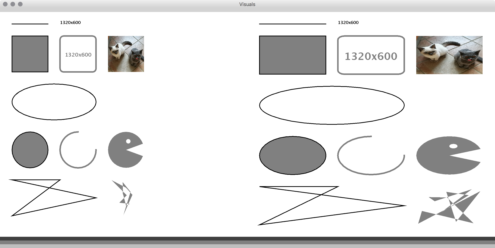

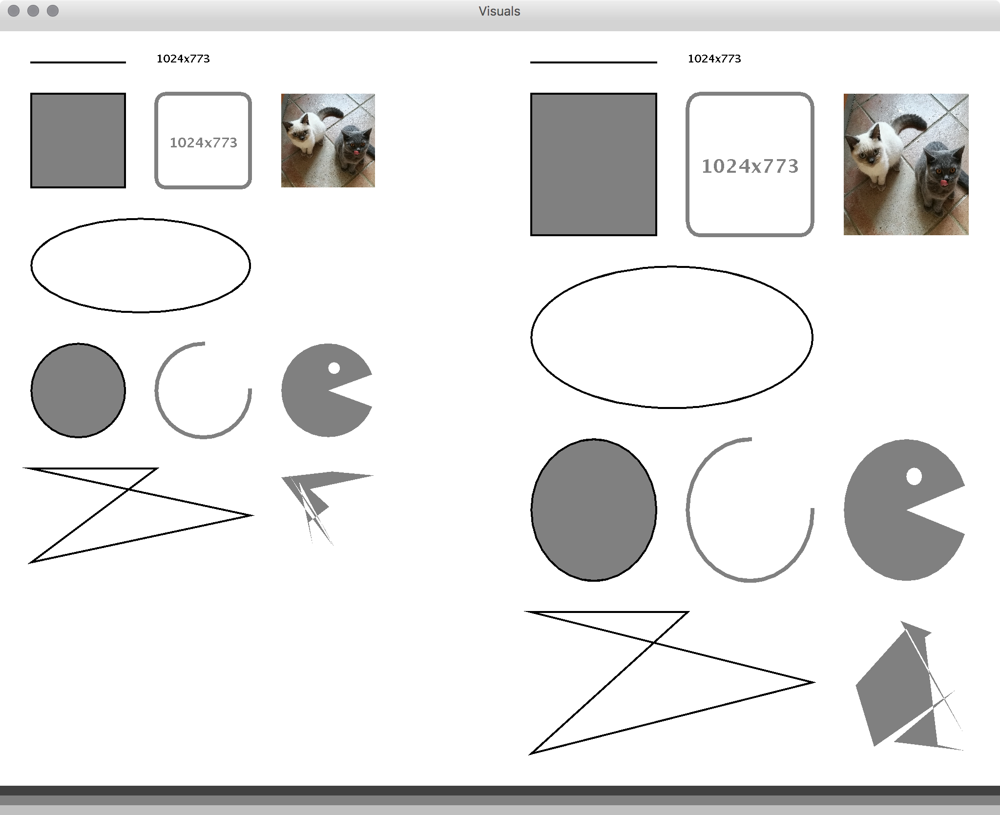

### Animacija likov in grafičnih oblik

Geometrijske **like in** grafične **oblike lahko animiramo** tako, da pri izrisu upoštevamo stanje izbranih (zunanjih) spremenljivk, ki jih na primer posodabljamo v določenih časovnih intervalih.

Spodnji program doda izris slike nogometne žoge, katere središče je predstavljeno z javno statično spremenljivko `ball` tipa `java.awt.Point` definirano v razredu `Visuals`.

```java
public class Visuals {
	public static Point ball = new Point();
	public static void main(String[] args) {
		...
		ball = new Point(panel.getWidth() / 2, panel.getHeight() / 2);
		...
	}
}
```
```java
class Panel extends JPanel {
	@Override
	public void paint(Graphics g) {
		...
		try { // shrani sliko v objektno spremenljivko!
			graphics.drawImage(ImageIO.read(new File("images", "football.png")), (int)Visuals.ball.getX() - 32, (int)Visuals.ball.getY() - 32, 64, 64, null);
		} catch (IOException e) {
			e.printStackTrace();
		}
	}
}
```

Spodnji program doda še animacijo nogometne žoge, ki se odbija od stranic panela po katerem rišemo.

```java	
public class Visuals {
	public static void main(String[] args) {
		...
		Point direction = new Point(16, -16);
		while (true) {
			ball.setLocation(ball.getX() + direction.getX(), ball.getY() + direction.getY());
			if (ball.getX() <= 32) {
				ball.setLocation(32, ball.getY());
				direction.setLocation(-direction.getX(), direction.getY());
			}
			else if (ball.getX() >= panel.getWidth() - 32) {
				ball.setLocation(panel.getWidth() - 32, ball.getY());
				direction.setLocation(-direction.getX(), direction.getY());
			}
			if (ball.getY() <= 32) {
				ball.setLocation(ball.getX(), 32);
				direction.setLocation(direction.getX(), -direction.getY());
			}
			else if (ball.getY() >= panel.getHeight() - 32) {
				ball.setLocation(ball.getX(), panel.getHeight() - 32);
				direction.setLocation(direction.getX(), -direction.getY());
			}
			frame.repaint();
			try {
				Thread.sleep(50);
			} catch (InterruptedException e) {
				e.printStackTrace();
			}
		}
	}
}
```

Primer izgleda grafičnega vmesnika je prikazan spodaj.

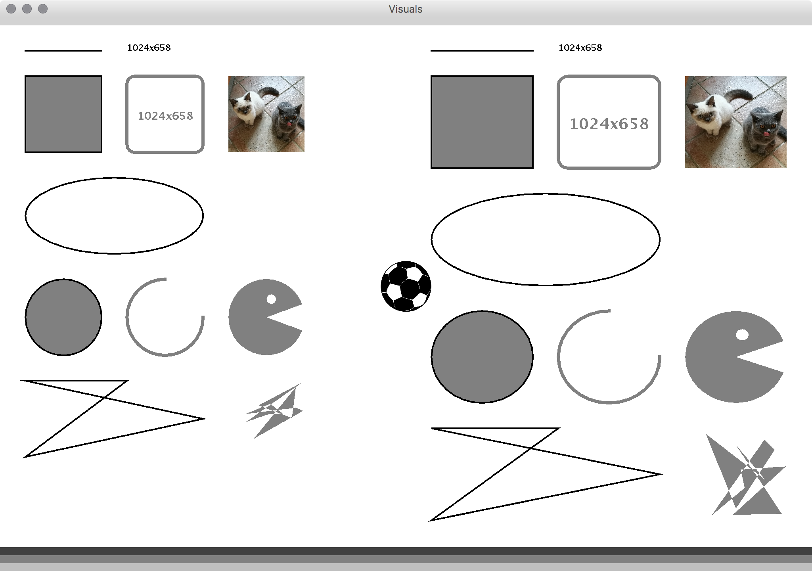

### Grafični elementi in nadzor programa

Panelom razreda `JPanel` lahko **dodamo različne grafične elemente** z uporabo metode `add(Component component)`. Med **osnovne grafične elemente** štejemo labele razreda `JLabel`, gumbe razredov `JButton` in `JToggleButton`, drsnike razreda `JSlider`, vnosna polja razreda `JTextField`, izbirnike razredov `JCheckBox` in `JComboBox` itd. v paketu `javax.swing`.

Grafični elementi **preko dogodkov** (npr. pritisk gumba, sprememba drsnika) **omogočajo nadzor** nad delovanjem programa oziroma grafičnega vmesnika. Na same dogodke se odzovemo tako, da grafičnemu elementu **dodamo poslušalca**, ki implementira vmesnik `java.util.EventListener` in s tem vse potrebne metode za odziv na dogodke grafičnega elementa.

Spodnji program **doda labelo** razreda `JLabel` severnemu panelu programskega okna.

```java
north.add(new JLabel("Football  "));
```

Primer izgleda grafičnega vmesnika je prikazan spodaj.

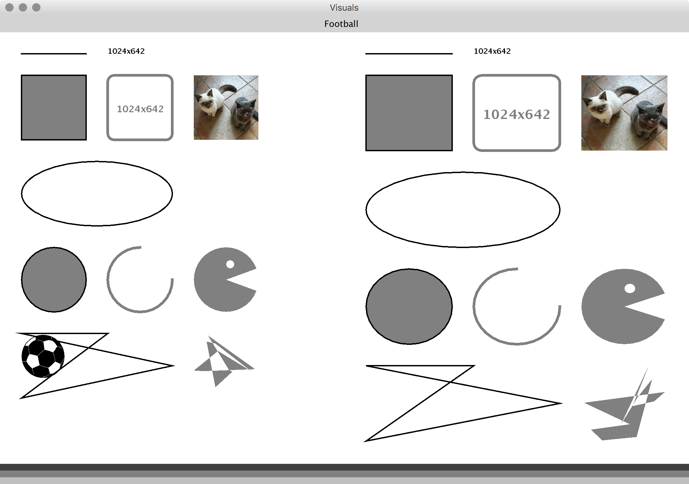

Spodnji program **doda gumb** razreda `JButton` severnemu panelu programskega okna. Gumbu **dodamo poslušalca**, ki implementira vmesnik `java.awt.event.ActionListener` in ob kliku na gumb nogometno žogo prestavi v središče osrednjega panela.

```java
JButton button = new JButton("Center");
button.setPreferredSize(new Dimension(96, 40));
button.addActionListener(new ActionListener() {
	@Override
	public void actionPerformed(ActionEvent e) {
		ball = new Point(panel.getWidth() / 2, panel.getHeight() / 2);
	}
});
north.add(button);
```

Primer izgleda grafičnega vmesnika je prikazan spodaj.

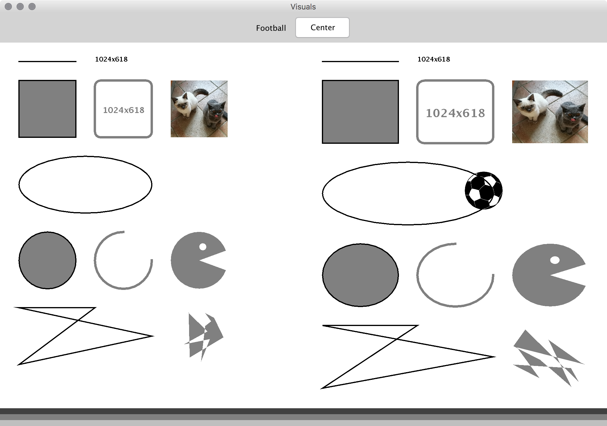

Spodnji program **doda drsnik** razreda `JSlider` severnemu panelu programskega okna, ki določa hitrost posodabljanja središča nogometne žoge. Drsniku **dodamo poslušalca**, ki implementira vmesnik `java.awt.event.ChangeListener` in ob spremembi zahteva ponoven izris osrednjega panela.

```java
JSlider slider = new JSlider(1, 100, 50);
slider.addChangeListener(new ChangeListener() {
	@Override
	public void stateChanged(ChangeEvent e) {
		panel.repaint();
	}
});
north.add(slider);
...
while (true) {
	...
	try {
		Thread.sleep(slider.getValue());
	} catch (InterruptedException e) {
		e.printStackTrace();
	}
}
```

Primer izgleda grafičnega vmesnika je prikazan spodaj.

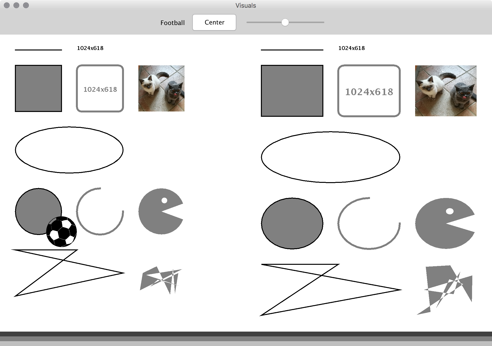

Spodnji program **doda izbirnik** razreda `JCheckBox` severnemu panelu programskega okna, ki nadzira posodabljanje središča nogometne žoge. Izbirniku **dodamo poslušalca**, ki implementira vmesnik `java.awt.event.ActionListener` in ob spremembi zahteva ponoven izris osrednjega panela.

```java
JCheckBox checkbox = new JCheckBox("Animate", true);
checkbox.addActionListener(new ActionListener() {
	@Override
	public void actionPerformed(ActionEvent e) {
		panel.repaint();
	}
});
north.add(checkbox);
...
while (true) {
	if (checkbox.isSelected()) {
		...
	}
	...
}
```

Primer izgleda grafičnega vmesnika je prikazan spodaj.

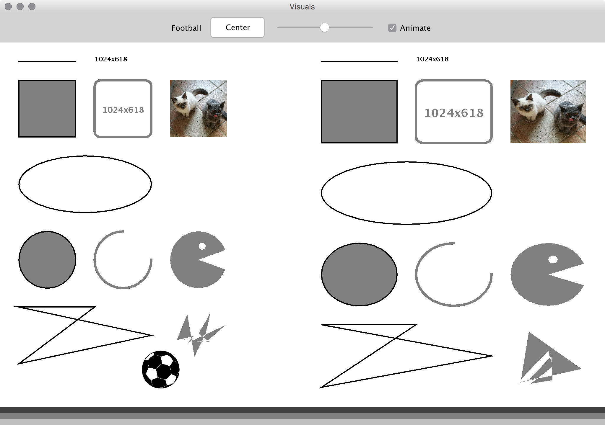

Spodnji program **doda vnosno polje** razreda `JTextField` severnemu panelu programskega okna, ki ob pritisku na vnašalko izbriše vsebino vnosnega polja. Vnosnemu polju **dodamo poslušalca**, ki implementira vmesnik `java.awt.event.KeyListener` in se izvede ob pritisku na poljubno tipko.

```java
JTextField field = new JTextField();
field.setPreferredSize(new Dimension(128, 24));
field.addKeyListener(new KeyListener() {
	@Override
	public void keyPressed(KeyEvent e) {
		if (e.getKeyCode() == KeyEvent.VK_ENTER)
			field.setText("");
	}
	@Override
	public void keyReleased(KeyEvent e) { }
	@Override
	public void keyTyped(KeyEvent e) { }
});
north.add(field);
```

Primer izgleda grafičnega vmesnika je prikazan spodaj.

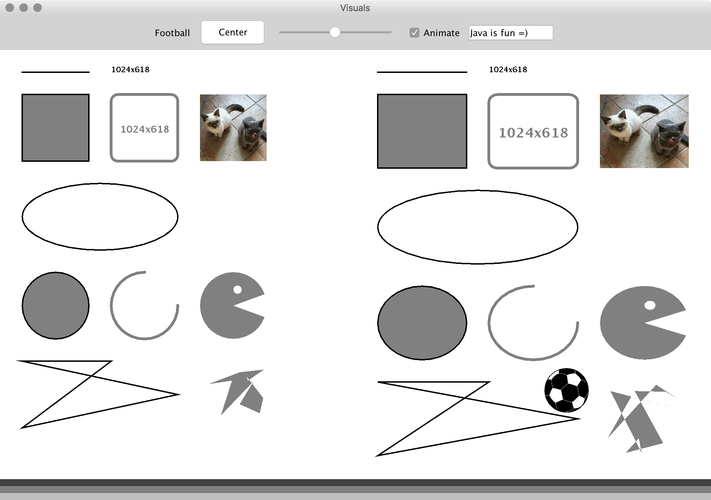